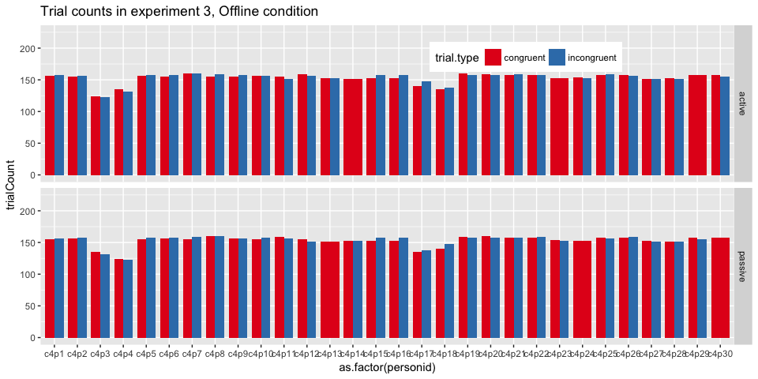
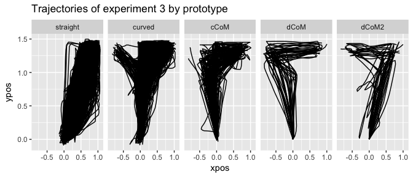

This is a complete script for analyzing the data collected in the
mouse-tracking Social Simon study and reported in the article (submitted). 
The study consisted of 3 experiments:

* experiment 1: individual Simon task, in which a person had to respond to two 
colors by moving right or left and clicking on a response "button"
* experiment 2: individual Go/NoGo version of the Simon task, in which a person 
had to respond to only one of the two colors
* experiment 3: joint Simon task, in which two people carried out the task
together, responding each to one of the colors; this experiment included two conditions:
    - Online condition: participants could see each other's mouse cursors
    - Offline condition: participants could see only their own mouse cursor

This script covers data preprocessing, data analysis reported in the article and
some additional analysis.


# Data pre-processing

First we get summary statistics for the participants in all experiments.


```r
participants <- read.csv("./data/Participant_stats.csv")

participants %>% group_by(experiment) %>%
    dplyr::summarize(mean.age = mean(age), 
              max.age = max(age),
              min.age = min(age)) -> 
    age.stats
participants %>% group_by(experiment, sex) %>%
    dplyr::summarize(gender.count = n()) -> gender.stats 
kable(age.stats)
```


experiment    mean.age   max.age   min.age
-----------  ---------  --------  --------
exp1          23.90000        30        19
exp2          26.52632        51        20
exp3          24.36667        54        18

```r
kable(gender.stats)
```


experiment   sex    gender.count
-----------  ----  -------------
exp1         F                14
exp1         M                 6
exp2         F                17
exp2         M                 2
exp3         F                48
exp3         M                12

Then we save the screen dimensions and relevant coordinates used in the experiment.


```r
# save experiment parameter values
screen.width <- 1920
screen.height <- 1080
start.boundary <- 988 # upper boundary of the start button
response.boundary <- 128 # lower boundary of response boxes
stim.boundary <- 820 # the y-coord that needed to be crossed for stimulus to appear
```


We then perform the following steps:

**Step 1** Load the data and reformat it for easier processing.


The data was recorded in a wide format, in which each row represented a particular 
trial. We transform it into a long format, in which each row corresponds to a 
particular timestamp and x,y-coordinates of a single trial of a single person.

The resulting first few rows of experiment 3, Offline condition:


 trial   subid   block   cuePos   cueColor   selectedBox      startTime       stimTime   order   times  person       x      y  personid   pair   condition 
------  ------  ------  -------  ---------  ------------  -------------  -------------  ------  ------  -------  -----  -----  ---------  -----  ----------
     1       1       2        2          1             1   -1.46347e+09   -1.46347e+09       1       0  p1         928   1051  c3p1       1      3         
     2       1       2        2          1             1    9.00000e-01    1.34000e+00       1       0  p1         788    926  c3p1       1      3         
     3       2       2        1          2             2    8.90000e-01    1.25000e+00       1       0  p1        1491   1035  c3p1       1      3         
     4       1       2        2          1             2    7.90000e-01    1.13000e+00       1       0  p1        1269   1060  c3p1       1      3         
     5       2       2        2          2             2    9.00000e-01    1.20000e+00       1       0  p1        1291    982  c3p1       1      3         
     6       2       2        2          2             2    9.40000e-01    1.20000e+00       1       0  p1        1212   1057  c3p1       1      3         

**Step 2** Add the coding for independent variables on 

* trial type, which depends on the congruency between the color of the cue and 
its location
* for experiment 2: whether it was the participant's turn to respond or inhibit a response,
which depends on the color of the cue
* for experiment 3: whose turn it was to respond in a given trial, 
which depends on the color of the cue


**Step 3** Flip y-coordinates vertically because the package that was
used for collecting the data (Matlab Psychtoolbox) encodes the screen's top left 
as coordinates [0, 0] and therefore y-coordinates grow towards the bottom of the screen
while for ease of analysis we would like them to grow towards the screen's top.


**Step 4** Filter out only successful trials, in which participants did not miss any
deadlines and a correct response was given.


**Step 5** Extract the relevant part of the trajectories, after the point in which
participants have clicked on the start button.


**Step 6** Rescale space

For convenience we rescale the coordinates into a standard mouse-tracking
coordinate space, where x is in range [-1, 1] and y in range [0, 1.5].


**Step 7** Align to common origin of [0, 0] and reset timestamps to start at 0.


At this point we can already visualize all trajectories of all individual participants
and pairs.

<!-- --><!-- --><!-- --><!-- -->

We see that in experiment 1, participant 5 has only few trajectories. We
can confirm this by looking at the number of trials this person has:


```r
p5 <- filter(exp1.aligned, personid == "c1p5")
length(unique(p5$trial))
```

```
## [1] 13
```

```r
# removing the participant data
exp1.aligned <- filter(exp1.aligned, personid != "c1p5")
```

In experiment 3, we see that most pairs seem to divide the screen space between 
each other by moving mostly directly towards their assigned response box and 
avoiding the center. However, there are exceptions. 

In condition with visual feedback one particular pair (11) has mostly 
upward moving trajectories. We can further explore here whether the joint upward 
motion is induced by one of the participants or happens immediately on both sides.

<!-- -->

The plot presents trajectories in the first couple of trials (1-7) of two
participants from pair 11. The trajectories are colored red for when participant's
role was "active", i.e. the cue that appeared had their assigned color and blue for
when their role was "passive", i.e. their task in such a trial was to not press
the response button and simply go back to the start position.

From the plots it would appear that one of the members of this aberrant couple
(person 2) adopts a "move upward" strategy from the start, independently of whether
it is their turn to respond or not. The other person in that couple seems to copy
the co-actor's movements on passive trials and make large discrete errors on the trials
in which it is actually their turn to respond. Why this particular couple behaves
in this manner is unfortunately unknown and might indicate some individual differences,
the feeling of jointness experienced by this couple or conscious strategies that 
people adopt in such a task.

In condition without visual feedback it is rather that certain individuals 
adopt the "move upward" strategy, independently of their partner (which is to be
expected since they do not see the partner's movements).

**Step 8** Flip trajectories

As the next pre-processing step we will flip all trajectories to one side.
This ensures that every trajectory starts at the bottom of the coordinate system 
and ends in the top right corner. It is done to obtain comparable trajectory 
measures.


**Step 9** Remove outliers

As a last step, we look at a sampling rate distribution to see whether it reveals 
any outliers that could indicate missing data or wrong recording.


From the data we can extract all intervals between adjacent sampling points and
calculate their mean and standard devation. We then establish a cutoff point of
3 SD from the mean beyond which the sampling interval is considered to be an outlier.
We calculate the number of such outliers for each condition and their mean sampling
rate. The resulting numbers are presented in the following table.


                rate.means   rate.sds   rate.cutoff   num.outliers   mean.outliers
-------------  -----------  ---------  ------------  -------------  --------------
exp1                 10.87       0.01         10.88            597           10.90
exp2                 10.87       0.01         10.91              8           13.60
exp3:online          10.87       1.13         14.26             41          207.71
exp4:offline         10.87       2.39         18.04            167          216.51

It turns out that the mean sampling rate for all experiments is 
within expected parameters given the set sampling rate of 92 Hz. The number of
outliers and their means varies with much larger deviations in experiment 3. 
Given the cross-computer data stream in the social task, some amount
of data loss is to be expected. We remove trials that contain these large deviations.

Next we look at y coordinates that should not be lower than some margin around 0
(after flipping and alignment). A y-coordinate that is more negative indicates a
faulty recording of the start button press.


With the sampling timing issues fixed, we can examine reaction time outliers.


**Step 10** Transform into a mousetrap object

For the analysis we will use a mousetrap package so we transform the data frames
into mousetrap objects.


**Step 11** Normalize trajectories

As a final pre-processing step, we perform time normalization on the data, in 
which the times and coordinates are linearly interpolated so that each trajectory 
contains the same number of recorded points (typically set to 101 points).


**Step 12** Check observation counts

We check whether all participants have a balanced number of observations 
for different variables of interest by plotting observation counts per person
per condition.


<!-- --><!-- --><!-- --><!-- -->

From the counts plot, we can see that in experiments 1 and 2 one person in each
has markedly less successful trials than other participants. In experiment 3,
Online condition, even though different numbers of trials remain for different 
pairs after removing unsuccessful ones, there are similar counts for different 
trial and role types.

By contrast, in experiment 3, Offline condition, three of the pairs completely 
lose observations for one of the incongruent set of trials, namely participants 
with ids 14, 23, 29 lose incongruent active trials while their co-actors 
(ids 13, 24, 30) incongruent passive ones. Further investigation of these counts 
reveals that the crucial step that leads to this loss is filtering out trials in 
which incorrect response was given, that is, participant clicked on the wrong 
response box. Given that this correlates with trials being incongruent (the cue 
appeared on the same side as the incorrect response box), we might infer that 
participants 14, 23 and 29 misunderstood the task, i.e. they were responding to 
the location of the cue, rather than its color. We can confirm this conclusion by 
plotting the trajectories of these participants.

<!-- -->

We see that indeed, 3 participants in condition 4 misunderstood the instructions
and therefore need to be removed from further analysis.


As a result of data cleaning, 7.8%, 6%, 
34% of trials in experiments 1-3 are removed.

# Dependent variables calculation

There is a number of measures that can be calculated on the basis of raw time
and normalized trajectories. Here we are interested only in the latter, although
a more complex analysis could involve looking at measures like velocity that require raw times.


These are the measures that are returned by mousetrap:

| Measure | Definition |
|:--------|:-----------------------------------------------|
|xpos_max|   Maximum x-position|
|xpos_min|   Minimum x-position|
|ypos_max|   Maximum y-position|
|ypos_min|   Minimum y-position|
|MAD|        Signed Maximum absolute deviation from the direct path connecting start and end point of the trajectory (straight line). If the MAD occurs above the direct path, this is denoted by a positive value; if it occurs below, by a negative value.|
| MAD_time|   Time at which the maximum absolute deviation was reached first|
| MD_above|   Maximum deviation above the direct path|
| MD_above_time|  Time at which the maximum deviation above was reached first|
| MD_below|   Maximum deviation below the direct path|
| MD_below_time|  Time at which the maximum deviation below was reached first|
| AD|         Average deviation from direct path|
| AUC|        Area under curve, the geometric area between the actual trajectory and the direct path where areas below the direct path have been subtracted|
| xpos_flips|         Number of directional changes along x-axis (exceeding the distance specified in flip_threshold)|
| ypos_flips|         Number of directional changes along y-axis (exceeding the distance specified in flip_threshold)|
| xpos_reversals|     Number of crossings of the y-axis|
| ypos_reversals|     Number of crossings of the x-axis|
| RT|                 Response time, time at which tracking stopped|
| initiation_time|    Time at which first mouse movement was initiated|
| idle_time|    Total time without mouse movement across the entirety of the trial|

Out of these measures, the most widely used are measures of the curvature of mouse
trajectories, i.e. MAD, AD and AUC. A variety of time-based measures allows us
to examine movement duration in different stages of the trajectory. Finally,
coordinate flips and reversals are a proxy for movement complexity (which we
later examine with an alternative entropy-based measure).

For the purpose of this paper we focus on the shape of movement trajectories
and basic reaction time measure.

Our data for experiments 2 and 3 contains trials in which a participant's role was 
'active', i.e., it was their turn to respond to the cue, and trials in which the 
role was 'passive', i.e., their task was to refrain from responding. 
It is reasonable to assume that different cognitive processes are at play in 
these types of trials and that different trajectories should result. 
Therefore, for further analysis we split the data into two groups: 
active and passive data and we examine them separately.


Finally, we aggregate dependent measures by averaging across trials within each 
participant for every level of the independent variable (Trial Type).


# Exploratory Analysis


## Reaction time plots


<!-- -->

## Trajectory plots

We plot trajectories averaged across trials for each participant and across participants.


<!-- -->


We also plot passive trajectories.

<!-- -->

From these plots it would seem that in experiment 1 the trial type affects
movement trajectory with incongruent trials taking longer and producing trajectories
more deviated towards the wrong response. By contrast, in experiment 2 and 3
both reaction time and trajectories look similar independently of the trial type.
Furthermore, in experiment 2 and 3 participants seem to go straight for their 
assigned response button instead of producing curved trajectories typically found 
in mouse-tracking studies.


# Statistical analysis

Exploratory analysis suggests that conditions differ in how the type of trial
affects participant behavior. There seems to be a notable Simon effect in the
individual condition but no effect in individual GoNo-Go condition or social conditions.

In this part we will complement plot-based observations with statistical analysis.
The analysis is carried out separately for 2 types of individual conditions and the
social conditions.

## Reaction time

The following are results for 

* a paired t-test on reaction times from experiment 1
* a paired t-test on reaction times from experiment 2
* a mixed ANOVA on reaction times from experiment 3 (between-subject variable
condition and within-subject variable trial type)


```
## 
## 	Paired t-test
## 
## data:  RT by trial.type
## t = -11.387, df = 18, p-value = 5.837e-10
## alternative hypothesis: true difference in means is less than 0
## 95 percent confidence interval:
##       -Inf -54.11587
## sample estimates:
## mean of the differences 
##               -63.83683
```

```
## 
## 	Paired t-test
## 
## data:  RT by trial.type
## t = -1.2806, df = 18, p-value = 0.1083
## alternative hypothesis: true difference in means is less than 0
## 95 percent confidence interval:
##      -Inf 2.733843
## sample estimates:
## mean of the differences 
##                -7.72143
```


```
## Anova Table (Type 3 tests)
## 
## Response: RT
##                 Effect    df      MSE    F   ges pes p.value
## 1            condition 1, 51 31525.70 1.58   .03 .03     .21
## 2           trial.type 1, 51   297.08 2.65 .0005 .05     .11
## 3 condition:trial.type 1, 51   297.08 1.08 .0002 .02     .30
## ---
## Signif. codes:  0 '***' 0.001 '**' 0.01 '*' 0.05 '+' 0.1 ' ' 1
```

We find a significantly larger reaction time in incongruent trials only in experiment 1.


## Area under curve

### Bimodality analysis

Sometimes, averaging trajectories produces artifical results. For example, a smooth
average trajectory for a given participant could be a result of a large number
of straight trajectories that go directly to the target and discrete error type
of trajectories where participant first moves directly to the wrong side and then
abruptly changes direction.

The main method to eliminate this possibility relies on bimodality analysis, which checks whether spatial measures are bimodally distributed. This can be determined by looking
at histograms of standardized trajectory deviation measures or by calculating
a bimodality coefficient.

<!-- -->

```
## $BC
##    trial.type     z_AUC
## 1   congruent 0.3600507
## 2 incongruent 0.3403739
```

<!-- -->

```
## $BC
##    trial.type     z_AUC
## 1   congruent 0.2689672
## 2 incongruent 0.2197816
```

<!-- -->

```
## $BC
##    trial.type     z_AUC
## 1   congruent 0.2189006
## 2 incongruent 0.2309513
```

A distribution is considered bimodal if BC > 0.555. In our case neither distribution
plots nor bimodality coefficients (which are below 0.555 for all conditions) give 
any reason to suspect bimodal data that could blur our results.

We therefore proceed with analysis of area under curve measure in experiments 1-3 
as with RT measure.


```
## 
## 	Paired t-test
## 
## data:  AUC by trial.type
## t = -6.7295, df = 18, p-value = 1.31e-06
## alternative hypothesis: true difference in means is less than 0
## 95 percent confidence interval:
##         -Inf -0.05666267
## sample estimates:
## mean of the differences 
##             -0.07633179
```

```
## 
## 	Paired t-test
## 
## data:  AUC by trial.type
## t = -0.98809, df = 18, p-value = 0.1681
## alternative hypothesis: true difference in means is less than 0
## 95 percent confidence interval:
##         -Inf 0.008074198
## sample estimates:
## mean of the differences 
##              -0.0106949
```


```
## Anova Table (Type 3 tests)
## 
## Response: AUC
##                 Effect    df  MSE      F    ges   pes p.value
## 1            condition 1, 51 0.03   0.11   .002  .002     .74
## 2           trial.type 1, 51 0.00 3.57 +  .0002   .07     .06
## 3 condition:trial.type 1, 51 0.00   0.02 <.0001 .0003     .90
## ---
## Signif. codes:  0 '***' 0.001 '**' 0.01 '*' 0.05 '+' 0.1 ' ' 1
```


# Individual-level analysis

## Individual trajectory plots

To check whether the patterns we find on the group level also hold on the individual 
level, we can also examine average trajectories of individual participants.

<!-- --><!-- --><!-- --><!-- -->

```
## quartz_off_screen 
##                 2
```

```
## quartz_off_screen 
##                 2
```

```
## quartz_off_screen 
##                 2
```

```
## quartz_off_screen 
##                 2
```

Here we can make several observations. 

1. The group pattern holds for all individuals in experiment 1.
2. In experiments 2 and 3 the group pattern holds for the majority but no all individuals.
3. The majority of participants in experiment 2 and 3 adopt a strategy of moving
directly toward the response box rather than moving first upward.
3. In experiment 2 six out of twenty participants seemt to show upward trajectories,
similar to those observed in experiment 1.
4. In experiment 3 five out of 58 participants show upward trajectories.
5. Most participants seem to proceed all the way to the response box even when
it is not their turn to respond, i.e. despite the fact that they could return to 
the starting position as soon as it became clear it is not their trial.

We can confirm the latter observation by also plotting a histogram of maximum y 
coordinate reached in passive trials. The thresholds indicated on the plot are the 
locations of the start boundary, the y-coordinate that had to be crossed in order 
for the cue to appear and the lower response box boundary. As can be seen from the plot,
the majority of trajectories goes beyond that last threshold.

<!-- -->


## Trajectory prototypes

In order to examine the qualitative difference between individual trajectories 
in a more unbiased manner, we can automatically assign participants to straight 
vs curved motion strategy based on the shape of the majority of their
trajectories. Mousetrap package provides a possibility for mapping collected 
trajectories to a number of trajectory prototypes frequently encountered in mouse 
tracking experiments, such as these:

<!-- -->

We can map trajectories collected in our experiment to the prototypes and plot them.
Given that variability is mostly present in experiments 2 and 3, we focus on this
data here.

<!-- --><!-- -->

We can also plot the distribution of trajectories for all the individual
participants, focusing here on the two main types, "straight" and "curved"+"cCoM" prototypes.

<!-- --><!-- --><!-- -->

We can now use the prototype information to asign participants to a "straight" or
"curved" group. We do this by simple majority i.e., if the majority of a given 
person's trajectories are straight, they are assigned to the straight group and 
analogously for the curved trajectories.


## Individual-level analyses

Since we have seen that participants tend to employ two qualitatively different
movement patterns, a question we can ask is whether two groups also lead to 
qualitatively different statistical results. To that end we run t-tests on the 
individual level. Our prediction is that curved participants but not straight 
participants show significantly higher RT and AUC in incongruent trials compared 
to congruent trials.


personid   measure          t         df         p   lower.conf   upper.conf   estimate1   estimate2   effect  prototype 
---------  --------  --------  ---------  --------  -----------  -----------  ----------  ----------  -------  ----------
c2p1       RT           1.330   247.8999   0.90762         -Inf       44.979     647.157     627.090    0.084  curved    
c2p1       AUC          0.435   307.7428   0.66800         -Inf        0.023       0.299       0.294    0.025  curved    
c2p13      RT          -1.913   299.0113   0.02834         -Inf      -10.168    1455.521    1529.412    0.110  curved    
c2p13      AUC        -24.194   298.4827   0.00000         -Inf       -0.187       0.114       0.314    0.814  curved    
c2p19      RT          -2.698   286.1834   0.00370         -Inf      -22.224     913.179     970.419    0.157  curved    
c2p19      AUC         -3.923   300.6781   0.00005         -Inf       -0.014       0.221       0.245    0.221  curved    
c2p2       RT          -1.991   312.8708   0.02370         -Inf       -5.337     841.910     873.074    0.112  curved    
c2p2       AUC         -1.939   312.0737   0.02670         -Inf       -0.001       0.180       0.190    0.109  curved    
c2p6       RT          -0.570   300.6392   0.28472         -Inf       13.917     981.930     989.266    0.033  curved    
c2p6       AUC         -1.529   309.4103   0.06365         -Inf        0.001       0.189       0.197    0.087  curved    
c2p10      RT          -1.297   310.2694   0.09773         -Inf        6.403     576.698     600.272    0.073  straight  
c2p10      AUC         -1.546   308.8431   0.06162         -Inf        0.001      -0.028      -0.016    0.088  straight  
c2p12      RT          -0.557   308.0955   0.28885         -Inf       19.441     571.196     581.114    0.032  straight  
c2p12      AUC         -0.041   317.9715   0.48353         -Inf        0.009       0.027       0.027    0.002  straight  
c2p14      RT           1.098   307.8853   0.86344         -Inf       38.873     647.283     631.751    0.062  straight  
c2p14      AUC         -0.661   314.6421   0.25467         -Inf        0.007       0.015       0.020    0.037  straight  
c2p15      RT           1.774   287.7966   0.96148         -Inf       75.220     793.960     754.985    0.104  straight  
c2p15      AUC         -0.225   308.9611   0.41113         -Inf        0.012       0.067       0.069    0.013  straight  
c2p16      RT           0.048   315.8738   0.51932         -Inf       35.921     748.770     747.744    0.003  straight  
c2p16      AUC          0.059   314.7867   0.52347         -Inf        0.055       0.160       0.158    0.003  straight  
c2p17      RT          -0.740   289.5166   0.23000         -Inf       19.013     505.743     521.196    0.043  straight  
c2p17      AUC         -0.777   316.5966   0.21875         -Inf        0.009       0.013       0.021    0.044  straight  
c2p18      RT           0.014   306.1270   0.50546         -Inf       39.749     716.145     715.818    0.001  straight  
c2p18      AUC          2.204   303.8850   0.98586         -Inf        0.044       0.086       0.061    0.125  straight  
c2p20      RT          -1.168   304.5004   0.12180         -Inf        6.944     520.109     536.956    0.067  straight  
c2p20      AUC          0.435   317.7656   0.66793         -Inf        0.026      -0.001      -0.006    0.024  straight  
c2p3       RT           0.536   317.9994   0.70395         -Inf       32.118     668.750     660.870    0.030  straight  
c2p3       AUC          1.314   316.1454   0.90511         -Inf        0.022      -0.059      -0.069    0.074  straight  
c2p4       RT           0.038   290.5561   0.51517         -Inf       27.122     783.832     783.220    0.002  straight  
c2p4       AUC         -1.072   317.2109   0.14222         -Inf        0.003      -0.022      -0.016    0.060  straight  
c2p5       RT           0.352   312.0240   0.63746         -Inf       41.007     694.001     686.790    0.020  straight  
c2p5       AUC          1.135   310.6857   0.87136         -Inf        0.026       0.016       0.005    0.064  straight  
c2p7       RT           0.545   313.4000   0.70695         -Inf       41.569     597.620     587.296    0.031  straight  
c2p7       AUC          1.799   303.6353   0.96350         -Inf        0.025      -0.025      -0.038    0.103  straight  
c2p8       RT           0.094   312.9494   0.53731         -Inf       40.516     691.541     689.363    0.005  straight  
c2p8       AUC         -0.073   312.8495   0.47086         -Inf        0.010      -0.006      -0.006    0.004  straight  
c2p9       RT          -0.919   310.0276   0.17933         -Inf       12.249     641.712     657.127    0.052  straight  
c2p9       AUC          0.178   310.2193   0.57043         -Inf        0.019       0.068       0.066    0.010  straight  


personid   measure         t         df         p   lower.conf   upper.conf   estimate1   estimate2   effect  prototype 
---------  --------  -------  ---------  --------  -----------  -----------  ----------  ----------  -------  ----------
c3p15      RT         -1.330   305.9785   0.09230         -Inf        6.658     823.698     851.350    0.076  curved    
c3p15      AUC        -1.380   306.0291   0.08426         -Inf        0.002       0.349       0.361    0.079  curved    
c3p21      RT         -5.522   291.3340   0.00000         -Inf      -86.231     982.340    1105.316    0.308  curved    
c3p21      AUC        -2.104   291.8940   0.01810         -Inf       -0.012       0.358       0.414    0.122  curved    
c3p22      RT         -0.966   293.7321   0.16738         -Inf       16.636    1053.534    1077.036    0.056  curved    
c3p22      AUC        -2.220   291.9261   0.01359         -Inf       -0.007       0.279       0.307    0.129  curved    
c4p11      RT          0.419   291.2212   0.66212         -Inf       43.106     868.290     859.566    0.025  curved    
c4p11      AUC        -0.360   299.7137   0.35944         -Inf        0.012       0.417       0.421    0.021  curved    
c4p19      RT         -0.118   311.5729   0.45310         -Inf       35.739     668.544     671.295    0.007  curved    
c4p19      AUC        -1.148   310.6841   0.12591         -Inf        0.011       0.370       0.395    0.065  curved    
c3p1       RT          0.991   273.2223   0.83868         -Inf       60.792     845.586     822.781    0.060  straight  
c3p1       AUC         2.483   273.5272   0.99318         -Inf        0.045      -0.006      -0.032    0.148  straight  
c3p10      RT         -1.013   276.0934   0.15598         -Inf       18.002     857.632     886.242    0.061  straight  
c3p10      AUC         0.949   274.5159   0.82825         -Inf        0.019       0.006      -0.001    0.057  straight  
c3p11      RT         -0.736   295.8101   0.23130         -Inf       18.840     646.178     661.331    0.043  straight  
c3p11      AUC        -0.297   296.8211   0.38337         -Inf        0.012       0.031       0.033    0.017  straight  
c3p12      RT         -1.822   289.4142   0.03475         -Inf       -3.902     687.782     729.180    0.106  straight  
c3p12      AUC        -1.357   297.9425   0.08791         -Inf        0.002      -0.024      -0.013    0.078  straight  
c3p13      RT          1.083   298.9992   0.86006         -Inf       45.947     650.628     632.425    0.062  straight  
c3p13      AUC         0.643   292.5906   0.73974         -Inf        0.018       0.013       0.008    0.038  straight  
c3p14      RT         -0.125   301.4069   0.45032         -Inf       36.973     695.874     698.904    0.007  straight  
c3p14      AUC         0.871   294.7539   0.80789         -Inf        0.012      -0.015      -0.019    0.051  straight  
c3p16      RT          0.679   306.9587   0.75104         -Inf       58.579     910.080     893.009    0.039  straight  
c3p16      AUC        -0.011   308.9997   0.49580         -Inf        0.010      -0.008      -0.008    0.001  straight  
c3p17      RT          0.400   307.4933   0.65523         -Inf       42.931     811.049     802.674    0.023  straight  
c3p17      AUC        -0.249   306.8774   0.40189         -Inf        0.015       0.005       0.008    0.014  straight  
c3p18      RT         -0.454   308.8503   0.32520         -Inf       29.985     708.539     719.911    0.026  straight  
c3p18      AUC         1.396   308.6144   0.91813         -Inf        0.019       0.045       0.036    0.079  straight  
c3p19      RT         -0.199   307.9039   0.42108         -Inf       22.338     562.427     565.497    0.011  straight  
c3p19      AUC         0.686   307.9990   0.75336         -Inf        0.014      -0.009      -0.014    0.039  straight  
c3p2       RT         -0.727   259.2412   0.23398         -Inf       20.109     797.046     812.867    0.045  straight  
c3p2       AUC        -0.183   278.0511   0.42744         -Inf        0.009       0.015       0.016    0.011  straight  
c3p20      RT         -1.879   306.6362   0.03060         -Inf       -4.001     564.873     597.684    0.107  straight  
c3p20      AUC        -0.189   304.2119   0.42503         -Inf        0.012       0.043       0.045    0.011  straight  
c3p23      RT          0.505   298.2400   0.69292         -Inf       42.446     858.005     848.064    0.029  straight  
c3p23      AUC        -0.617   302.5230   0.26887         -Inf        0.009      -0.043      -0.037    0.035  straight  
c3p24      RT         -0.317   269.7983   0.37571         -Inf       21.476     825.611     830.718    0.019  straight  
c3p24      AUC         1.353   292.9385   0.91139         -Inf        0.049      -0.107      -0.129    0.079  straight  
c3p25      RT         -0.236   301.7348   0.40695         -Inf       26.185     662.181     666.543    0.014  straight  
c3p25      AUC         0.162   299.0900   0.56434         -Inf        0.028      -0.066      -0.068    0.009  straight  
c3p26      RT          0.199   298.7493   0.57892         -Inf       37.825     662.828     658.751    0.012  straight  
c3p26      AUC        -1.230   298.2419   0.10990         -Inf        0.003       0.011       0.021    0.071  straight  
c3p27      RT          0.021   308.0775   0.50819         -Inf       30.945     682.495     682.114    0.001  straight  
c3p27      AUC        -1.306   309.8106   0.09633         -Inf        0.003      -0.014      -0.003    0.074  straight  
c3p28      RT          0.547   308.0763   0.70752         -Inf       48.174     652.309     640.318    0.031  straight  
c3p28      AUC        -1.163   308.2462   0.12288         -Inf        0.003       0.020       0.026    0.066  straight  
c3p29      RT          1.030   311.2150   0.84812         -Inf       54.597     716.156     695.170    0.058  straight  
c3p29      AUC         0.448   311.0265   0.67275         -Inf        0.022      -0.036      -0.041    0.025  straight  
c3p3       RT         -0.124   280.8685   0.45061         -Inf       39.982     923.681     926.936    0.007  straight  
c3p3       AUC        -0.095   281.9754   0.46234         -Inf        0.017       0.016       0.018    0.006  straight  
c3p30      RT          0.012   314.9471   0.50498         -Inf       35.722     707.475     707.206    0.001  straight  
c3p30      AUC        -1.027   314.9878   0.15249         -Inf        0.003      -0.030      -0.025    0.058  straight  
c3p4       RT          0.819   297.5870   0.79333         -Inf       49.070     835.164     818.884    0.047  straight  
c3p4       AUC        -0.338   293.2122   0.36777         -Inf        0.007      -0.046      -0.044    0.020  straight  
c3p7       RT         -0.305   306.5288   0.38016         -Inf       25.348     846.062     851.818    0.017  straight  
c3p7       AUC        -1.277   305.7832   0.10132         -Inf        0.003      -0.042      -0.032    0.073  straight  
c3p8       RT         -1.271   288.4594   0.10241         -Inf        7.952     704.009     730.648    0.075  straight  
c3p8       AUC        -0.988   303.9484   0.16192         -Inf        0.006       0.052       0.061    0.057  straight  
c3p9       RT         -0.553   294.7873   0.29043         -Inf       20.452     723.426     733.729    0.032  straight  
c3p9       AUC        -0.536   293.4847   0.29626         -Inf        0.014      -0.001       0.006    0.031  straight  
c4p1       RT         -0.575   309.6652   0.28285         -Inf       21.339     640.961     652.378    0.033  straight  
c4p1       AUC        -1.466   296.9858   0.07181         -Inf        0.001      -0.013      -0.004    0.085  straight  
c4p10      RT         -0.507   307.7276   0.30618         -Inf       23.607     722.055     732.535    0.029  straight  
c4p10      AUC        -0.093   303.5380   0.46291         -Inf        0.016       0.067       0.068    0.005  straight  
c4p12      RT          1.144   304.0525   0.87332         -Inf       63.790    1009.360     983.234    0.065  straight  
c4p12      AUC         0.821   309.8331   0.79382         -Inf        0.021      -0.007      -0.014    0.047  straight  
c4p13      RT          0.957   278.5837   0.83035         -Inf       68.167     816.066     791.042    0.057  straight  
c4p13      AUC        -1.509   299.5386   0.06619         -Inf        0.001      -0.045      -0.032    0.087  straight  
c4p15      RT          0.224   303.7783   0.58856         -Inf       27.059     654.029     650.794    0.013  straight  
c4p15      AUC        -1.267   306.1601   0.10306         -Inf        0.003       0.064       0.074    0.072  straight  
c4p16      RT         -0.659   302.2551   0.25517         -Inf       23.127     672.621     688.004    0.038  straight  
c4p16      AUC        -0.171   304.9985   0.43229         -Inf        0.009       0.008       0.009    0.010  straight  
c4p17      RT         -0.167   279.5005   0.43379         -Inf       33.628     919.385     923.169    0.010  straight  
c4p17      AUC         0.311   276.9127   0.62189         -Inf        0.021      -0.053      -0.056    0.019  straight  
c4p18      RT         -0.649   254.5558   0.25853         -Inf       24.729     902.740     918.750    0.041  straight  
c4p18      AUC         0.195   267.2993   0.57735         -Inf        0.017       0.013       0.011    0.012  straight  
c4p2       RT         -1.259   290.9290   0.10448         -Inf        8.062     663.466     689.438    0.074  straight  
c4p2       AUC         0.648   295.2739   0.74110         -Inf        0.011      -0.016      -0.019    0.038  straight  
c4p20      RT         -0.974   297.8695   0.16554         -Inf       11.399     556.644     573.049    0.056  straight  
c4p20      AUC         0.187   307.8949   0.57412         -Inf        0.009      -0.024      -0.025    0.011  straight  
c4p21      RT         -0.016   313.4617   0.49349         -Inf       36.423     677.579     677.943    0.001  straight  
c4p21      AUC        -2.377   313.7089   0.00902         -Inf       -0.007      -0.046      -0.022    0.133  straight  
c4p22      RT          1.681   307.9808   0.95313         -Inf       64.395     757.900     725.400    0.095  straight  
c4p22      AUC         0.691   307.1538   0.75482         -Inf        0.013       0.031       0.028    0.039  straight  
c4p24      RT         -0.975   287.7842   0.16512         -Inf       17.250     779.415     804.343    0.057  straight  
c4p24      AUC        -0.523   295.4819   0.30084         -Inf        0.005      -0.022      -0.019    0.030  straight  
c4p25      RT         -0.361   314.4189   0.35911         -Inf       21.119     645.840     651.760    0.020  straight  
c4p25      AUC        -0.229   314.4648   0.40954         -Inf        0.012      -0.059      -0.058    0.013  straight  
c4p26      RT         -0.503   297.2484   0.30764         -Inf       27.649     715.564     727.692    0.029  straight  
c4p26      AUC        -0.422   295.4242   0.33680         -Inf        0.011      -0.032      -0.028    0.025  straight  
c4p27      RT         -0.926   287.3391   0.17761         -Inf       16.777     635.646     657.098    0.055  straight  
c4p27      AUC        -0.749   295.7687   0.22712         -Inf        0.008      -0.093      -0.087    0.044  straight  
c4p28      RT         -0.580   300.3503   0.28111         -Inf       20.335     610.980     622.009    0.033  straight  
c4p28      AUC         0.359   300.5094   0.63995         -Inf        0.017      -0.019      -0.022    0.021  straight  
c4p30      RT          1.208   282.5530   0.88595         -Inf       66.012    1009.727     981.830    0.072  straight  
c4p30      AUC        -1.164   299.7473   0.12272         -Inf        0.003      -0.050      -0.041    0.067  straight  
c4p5       RT         -1.992   292.5520   0.02366         -Inf       -7.099     630.788     672.167    0.116  straight  
c4p5       AUC        -0.017   304.1938   0.49339         -Inf        0.015      -0.032      -0.032    0.001  straight  
c4p6       RT          1.007   292.2110   0.84257         -Inf       58.679     649.365     627.129    0.059  straight  
c4p6       AUC         0.689   302.3662   0.75442         -Inf        0.016      -0.019      -0.023    0.040  straight  
c4p7       RT          1.055   313.1871   0.85384         -Inf       46.790     528.937     510.688    0.059  straight  
c4p7       AUC         1.797   309.2289   0.96334         -Inf        0.032       0.009      -0.008    0.102  straight  
c4p8       RT          0.260   309.6191   0.60229         -Inf       37.630     664.804     659.690    0.015  straight  
c4p8       AUC        -0.261   309.5734   0.39726         -Inf        0.007       0.012       0.013    0.015  straight  
c4p9       RT          0.064   278.9832   0.52544         -Inf       25.744     703.853     702.894    0.004  straight  
c4p9       AUC        -0.914   301.1120   0.18075         -Inf        0.006      -0.018      -0.011    0.053  straight  


## Sample entropy

In some cases, it may be helpful to measure the complexity of mouse trajectories. 
For example, if both response alternatives simultaneously attract participants'
mouse movement (relative to only one), this additional stress might manifest 
as less smooth, more complex, and fluctuating trajectories. 
One of the measures of trajectory complexity is sample entropy, which is based on
predictability of trajectory given a number of surrounding coordinates.
We calculate sample entropy for all the data using a function provided by the
mousetrap package with default settings. It is calculated for all individual trajectories
and then we average across trajectories to obtain measures for each participant,
separately for different data types and separately for active and passive trials
(in experiments 2 and 3).


Having obtained sample entropy measure we can subject it to standard statistical
analyses. We compare the measures for congruent and incongruent trials (experiments
1-3) and for passive and active trials (experiments 2 and 3).


```
## 
## 	Paired t-test
## 
## data:  sample_entropy by trial.type
## t = -9.115, df = 18, p-value = 3.644e-08
## alternative hypothesis: true difference in means is not equal to 0
## 95 percent confidence interval:
##  -0.0327411 -0.0204752
## sample estimates:
## mean of the differences 
##             -0.02660815
```

```
## Anova Table (Type 3 tests)
## 
## Response: sample_entropy
##                 Effect    df  MSE    F   ges pes p.value
## 1           trial.type 1, 16 0.00 2.50 .0005 .14     .13
## 2            role.type 1, 16 0.00 2.18   .06 .12     .16
## 3 trial.type:role.type 1, 16 0.00 1.11 .0005 .06     .31
## ---
## Signif. codes:  0 '***' 0.001 '**' 0.01 '*' 0.05 '+' 0.1 ' ' 1
```

```
## Anova Table (Type 3 tests)
## 
## Response: sample_entropy
##                 Effect    df  MSE    F   ges  pes p.value
## 1            condition 1, 48 0.00 0.40  .008 .008     .53
## 2           trial.type 1, 48 0.00 1.09 .0002  .02     .30
## 3 condition:trial.type 1, 48 0.00 0.63 .0001  .01     .43
## ---
## Signif. codes:  0 '***' 0.001 '**' 0.01 '*' 0.05 '+' 0.1 ' ' 1
```

In experiment 1 we see a highly significant difference in sample entropy between
congruent and incongruent trials, indicating that participants' movement in 
incongruent trials was more erratic. By contrast, in experiments 2 and 3, there 
seems to be no effect on movement entropy by either role or trial type. Thus, entropy
measure replicates the results of RTs and trajectory deviation.
